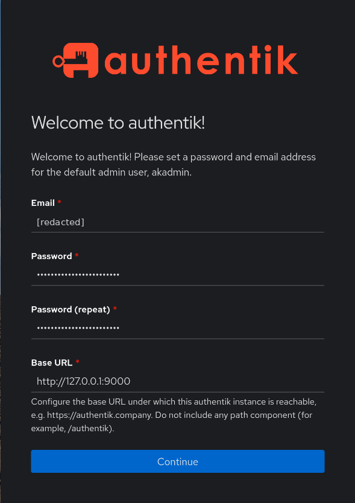
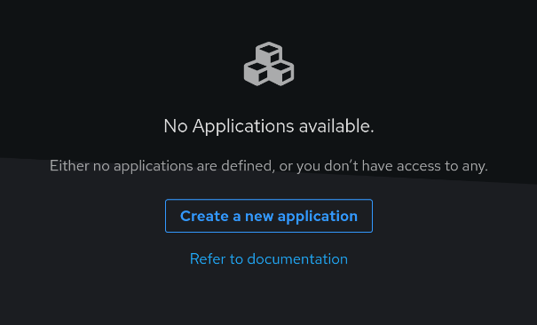

# 003 – Første login og validering

## Formål

Registrere den indledende opsætning af Authentik og kontrollere, at login virker efter installationen beskrevet i [002 – Lokal installation af Authentik](002-lokal-authentik.md).

## Indledende opsætning

Ved første besøg på Authentik blev browseren sendt videre til opsætningssiden. Her angives e-mail og adgangskode til standardadministratoren `akadmin` samt instansens Base URL. E-mailen er skjult i skærmbilledet.

*Opsætningssiden for Authentiks standardadministrator, `akadmin`.*

## Resultat

Opsætningen er gennemført, og login giver adgang til Authentik-dashboardet. Der er endnu ingen applikationer tilgængelige. Vi fortsætter med Authentik, når den første service skal integreres.

*Dashboardet er tilgængeligt, men der er endnu ingen applikationer.*
